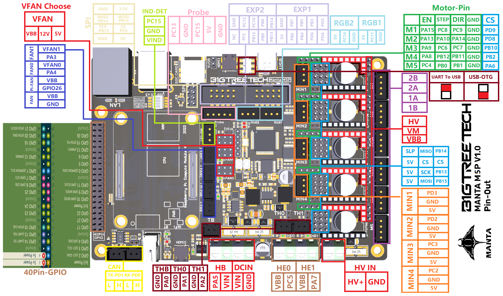

# Anycubic Kobra 2 Max with BigTreeTech Manta M5P

## Prologue

I recently purchased a Kobra 2 Max 3D printer from Anycubic. Especially the big build volume led to my decision buying this printer. I was aware that it has
just some closed-up version of Klipper installed, but as I was not that familiar with 3D printing that time, I paid far too little attention to what this could
mean to me and my prints.

### Issues arise

I was happy with my prints, especially those using PLA as filament. But when choosing ABS or ASA I experienced a little issue that bothered me: Regardless of
the settings in my slicer - I'm using PrusaSlicer - after the first layer was completed, the part cooling fan turned on to 100 %, leading the bed (set to 90 °C)
to cool down a bit. This caused an error after it had reached 85 °C, aborting the print immediately. I did some analysis, tried some different workarounds like
e.g. adding a `M107` or a `M106 S0` right after the first layer in the G-Code or before the second layer, but the only thing that worked... was... going to the
printer, waiting for the first layer to complete and turning off the fan by hand using the printer's control board.

### Looking for a solution

I was not happy with that. So I started looking for another solution. Vanilla Klipper seemed to be the "holy grail" for my issue. I read some reports about
installing Klipper on a Kobra 2. But as mentioned there, unfortunately this was **not** possible for a Kobra 2 Pro/Plus/Max with the built-in "TriGorilla_Spe_A"
mainboard. Long story short... since a 3D printer is just a framework with some stepper motors, moving all axes and the filament, and some heaters, this all can
be controlled by **any** mainboard designed for that. Thus, I chose to replace this board with another one, giving me the ability to install vanilla Klipper on,
to have full flexibility controlling my printer.

## Solution found - Presenting it to you so you can benefit

I just came across the website from [@1coderookie](https://github.com/1coderookie): [Kobra2MaxInsights](https://1coderookie.github.io/Kobra2MaxInsights/) which
basically describes every little part of the printer - it is just a gold mine for everyone that aims for modding this printer. BTW, there are corresponding
URLs for the Kobra 2 Pro and Plus, too. But all in all the printers of the Kobra 2 Pro/Plus/Max series do not differ that much at all (except for the printing
volume, of course).

1coderookie there describes a mod, replacing the stock mainboard with a MKS Robin Nano v3.1. As I already had taken a lookaround and found the BigTreeTech Manta
boards very promising, I chose to go with a [Manta M5P](https://biqu.equipment/de/products/manta-m4p-m8p?variant=40215553900642). The only problem was that the
stock connectors were not compatible with the sockets on the M5P board. I did not want to modify the stock connectors, I just wanted an in-place replacement of
the board, so if anything does not work as planned I could simply switch back to the stock mainboard, having a fully functional printer again.

So I ordered a Manta M5P board along with a CB1 computing module, five TMC2209 steppers and a heatsink for the CB1. Furthermore, I ordered some PH, XH and PHB
wires of different sizes as described in 1coderookie's modding howto to build the required adapter wires. In the following I will describe my resulting setup
for you to use it either for a 1:1 adaption or as a starting point for further improvements.

### Wire mapping

**Stock mainboard pinout**

To be added

**Manta M5P pinout**

Source: https://github.com/bigtreetech/Manta-M5P/blob/e1692ada06ddcb63f567f5ddfb9bfab581a42240/Hardware/BIGTREETECH%20MANTA%20M5P%20V1.0-Pin.png

In the following table you find the mapping of the stock mainboard connector pins to the Manta M5P connector pins.

| Part                             | Stock Mainboard Connector | Pin      | Manta M5P Connector | Pin  |
|:---------------------------------|---------------------------|----------|---------------------|------|
| Power Supply                     | POWER                     | PSU+     | DCIN                | VIN  |
|                                  | POWER                     | PSU-     | DCIN                | GND  |
| Hotbed Power Supply              | HOTBED                    | HOTBED+  | HB                  | VIN  |
|                                  | HOTBED                    | HOTBED-  | HB                  | PA5  |
| Mainboard Fan                    | MB-FAN                    | FAN+     | FAN                 | VBB  |
|                                  | MB-FAN                    | FAN-     | FAN                 | GND  |
| Hotbed Thermistor                | T1                        | T1       | THB                 | PA0  |
|                                  | T1                        | GND      | THB                 | GND  |
| Calibration Switch               | CALIBRATION               | S        | MIN3                | PC3  |
|                                  | CALIBRATION               | GND      | MIN3                | GND  |
| Hotbed Acceleration Sensor       | ACC-SENSOR                | GND      | RGB1                | GND  |
|                                  | ACC-SENSOR                | MOSI     | EXP2                | PB15 |
|                                  | ACC-SENSOR                | MISO     | EXP2                | PB14 |
|                                  | ACC-SENSOR                | SCLK     | EXP2                | PB13 |
|                                  | ACC-SENSOR                | CS       | EXP1                | PB4  |
|                                  | ACC-SENSOR                | GND      | RGB1                | GND  |
|                                  | ACC-SENSOR                | 5V       | RGB1                | 5V   |
| Y-Axis Motor                     | Y-CON                     | A1       | M2                  | 1A   |
|                                  | Y-CON                     | A2       | M2                  | 1B   |
|                                  | Y-CON                     | B1       | M2                  | 2A   |
|                                  | Y-CON                     | B2       | M2                  | 2B   |
| Y-Axis Limit Switch              | Y-CON                     | GND      | MIN2                | GND  |
|                                  | Y-CON                     | LIMIT    | MIN2                | PD2  |
| Printhead Hotend Power Supply    | E-CON                     | H+       | HE0                 | VBB  |
|                                  | E-CON                     | H-       | HE0                 | PC5  |
| Printhead Acceleration Sensor    | E-CON                     | MOSI     | EXP2                | PB15 |
|                                  | E-CON                     | MISO     | EXP2                | PB14 |
|                                  | E-CON                     | SCLK     | EXP2                | PB13 |
|                                  | E-CON                     | CS       | EXP1                | PB5  |
| Printhead Inductive Level Sensor | E-CON                     | LEVEL    | EXP2                | PC12 |
| Printhead Hotend Thermistor      | E-CON                     | T0       | TH0                 | PA1  |
| Printhead GND                    | E-CON                     | GND      | RGB2                | GND  |
| Printhead 5V Supply              | E-CON                     | 5V       | RGB2                | 5V   |
| Printhead 24V Supply             | E-CON                     | 24V      | IND-DET             | VIND |
| Printhead Heatsink Cooling Fan   | E-CON                     | F1       | FAN1                | PA3  |
| Printhead Part Cooling Fan       | E-CON                     | F0       | FAN0                | PA4  |
| Extruder Motor                   | E-CON                     | A1       | M4                  | 1A   |
|                                  | E-CON                     | A2       | M4                  | 1B   |
|                                  | E-CON                     | B1       | M4                  | 2A   |
|                                  | E-CON                     | B2       | M4                  | 2B   |
| Z-Axis Motor Left                | ZL                        | A1       | M3A                 | 1A   |
|                                  | ZL                        | A2       | M3A                 | 1B   |
|                                  | ZL                        | B1       | M3A                 | 2A   |
|                                  | ZL                        | B2       | M3A                 | 2B   |
| Z-Axis Motor Right               | ZR                        | A1       | M3B                 | 1A   |
|                                  | ZR                        | A2       | M3B                 | 1B   |
|                                  | ZR                        | B1       | M3B                 | 2A   |
|                                  | ZR                        | B2       | M3B                 | 2B   |
| X-Axis Limit Switch              | X-CON                     | X LIMIT  | MIN1                | PD3  |
|                                  | X-CON                     | GND      | MIN1                | GND  |
| Filament Runout Sensor           | X-CON                     | GND      | MIN4                | GND  |
|                                  | X-CON                     | FILAMENT | MIN4                | PC2  |
| X-Axis Motor                     | X-CON                     | A1       | M1                  | 1A   |
|                                  | X-CON                     | A2       | M1                  | 1B   |
|                                  | X-CON                     | B1       | M1                  | 2A   |
|                                  | X-CON                     | B2       | M1                  | 2B   |

### printer.cfg

You can find a basic printer.cfg [here](config/printer.cfg).

### Mainboard enclosure

To be added

### What does not work?

Unfortunately, I was not able to get the printhead's accelerometer working. I don't really have an idea what the problem might be, but I found out that it seems
to have something to do with the wiring of the printhead's inductive sensor (probe). If I disconnected the probe (PC12) the accelerometer could be queried using
the `ACCELEROMETER_QUERY` macro. If I connected it again, the console showed an error `Invalid lis2dw id got 8 vs 44`. The hotbed accelerometer worked without
any issues.

I decided to remove the corresponding configuration parts from the [printer.cfg](config/printer.cfg). I ordered an ADXL345 v2.0 from Bigtreetech that I just
connect via USB and do the resonance measurement for each axis after another. Since the resonance measurement is only required to be done if the overall printer
setup changes, this is a feasible solution for me.

# Disclaimer

By using the content in this repository, you acknowledge that you do so at your own risk. I am not liable for any damages or issues that may arise from
attempting the modifications or any other use of this material. The firmware mentioned is proprietary and not included here. For takedown requests or
suggestions, please contact me directly.

I am not affiliated with, or sponsored by any of the companies or persons mentioned in this repository. All product and company names are the registered
trademarks of their original owners. The use of any trade name or trademark is for identification and reference purposes only and does not imply any association
with the trademark holder of their product brand.
